### 第一阶段 纯球体光追

记录一下：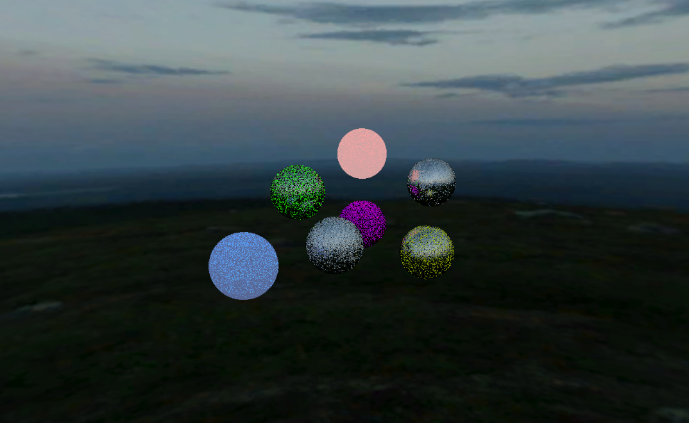

### 第二阶段 实现AS加速结构

下图是通过加速结构获得的网格包围盒
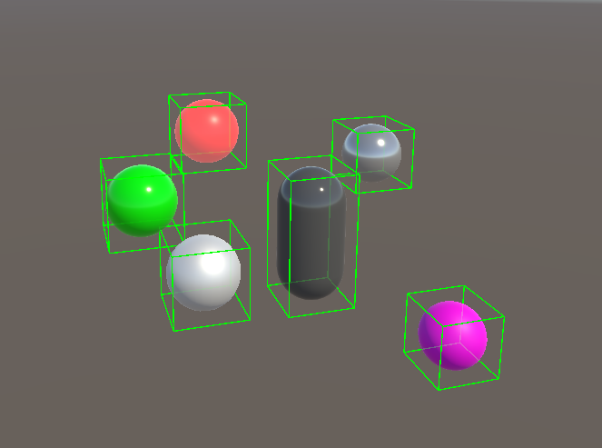
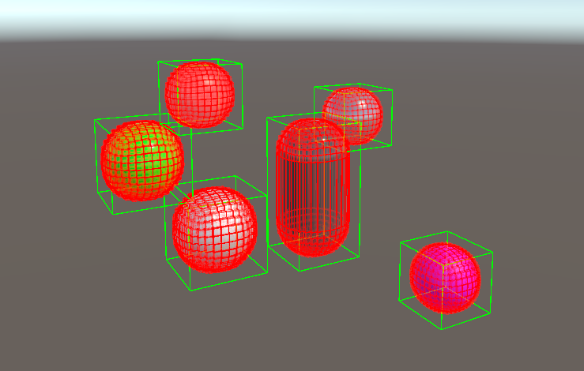

遇到了一些难题，使用栈的时候光线无法正确和BVH相交，但是使用递归的时候可以，这样的帧率很低，只能渲染单一信息，这个问题还没有解决，希望下一阶段可以解决。
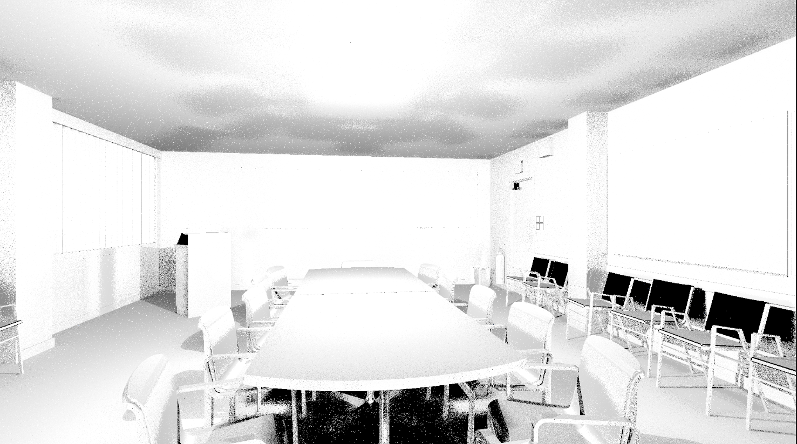
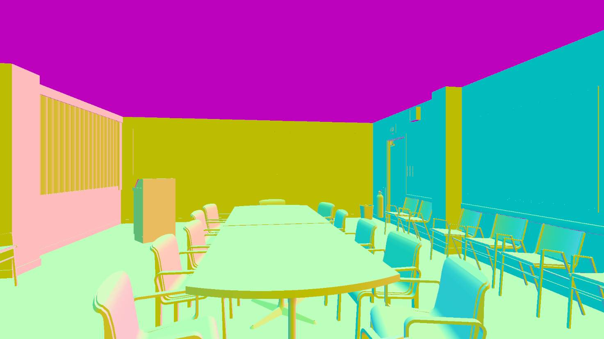
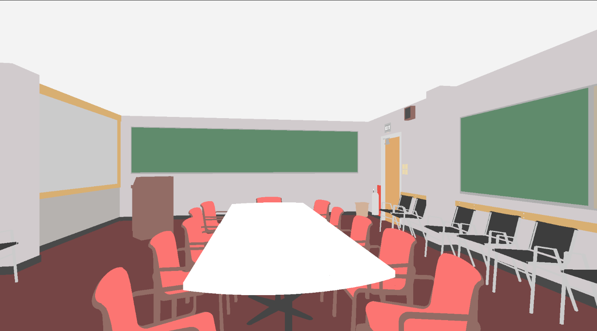

### 第三阶段 实现初步光线追踪
优化了一下BVH的构建，现在可以通过栈的方式而非递归的方式来获取BVH，现在帧率稍微高了一点，并且可以运行初步的光追了。
但色彩上还有些问题

### 第四阶段 修正颜色问题
修正了颜色问题，但某些场景下偏暗。阴影有些硬。后面发现是由于用了“类似”NEE的思想导致的

### 第五阶段 内存&性能提升
内存从原来的大量复制占用15gb，减少到100-200mb
fps提升20倍，复杂场景1.7->37、0.2->8等，简单场景8->120...

### 第六阶段 解决方向光不起作用的问题 && 添加反射验证
解决方向光不起作用的问题
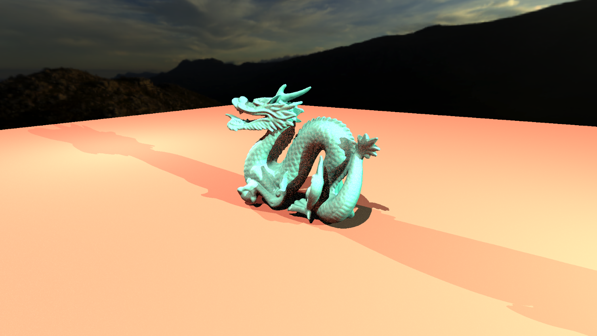
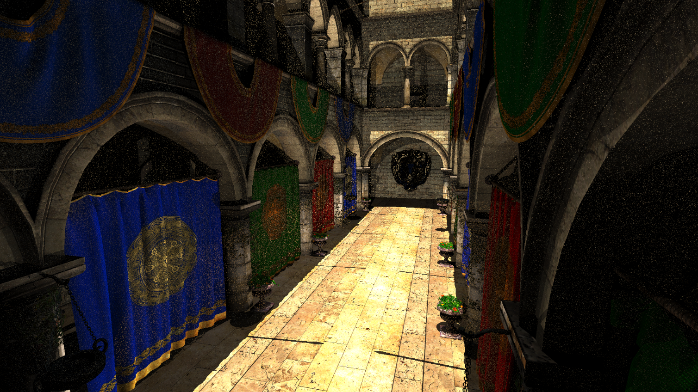
添加反射验证
无反射
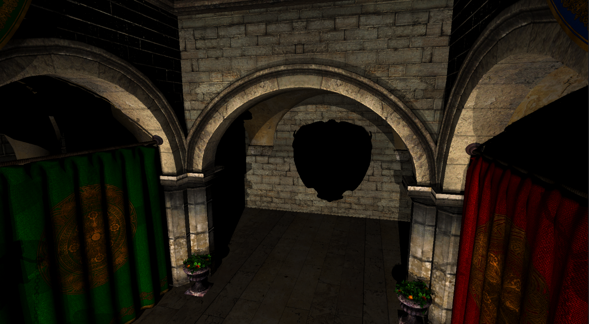
有反射
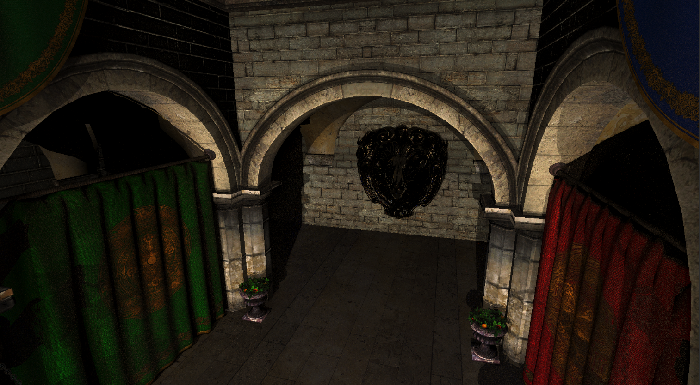

### 第七阶段 添加CPU侧三角形相交测试 && 解决BUG
三角形测试
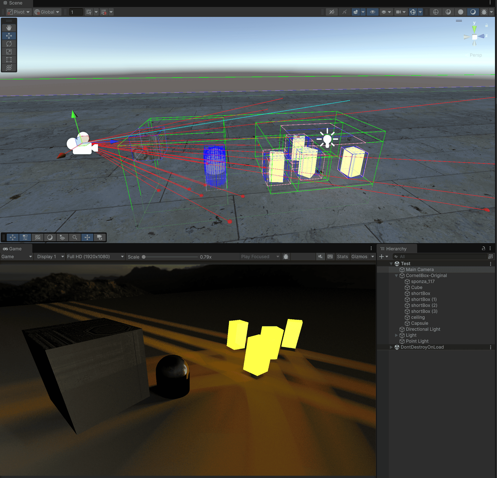
修复BUG后效果
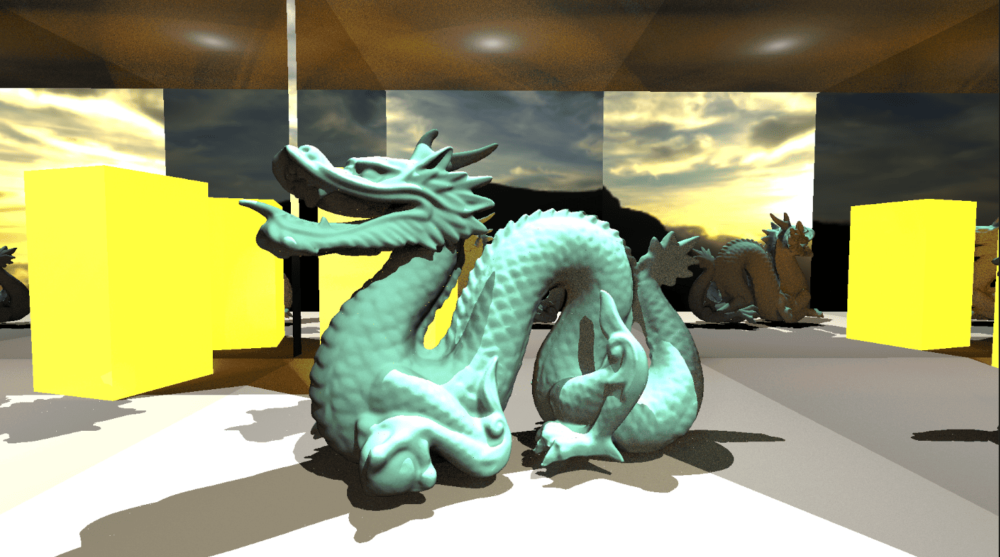
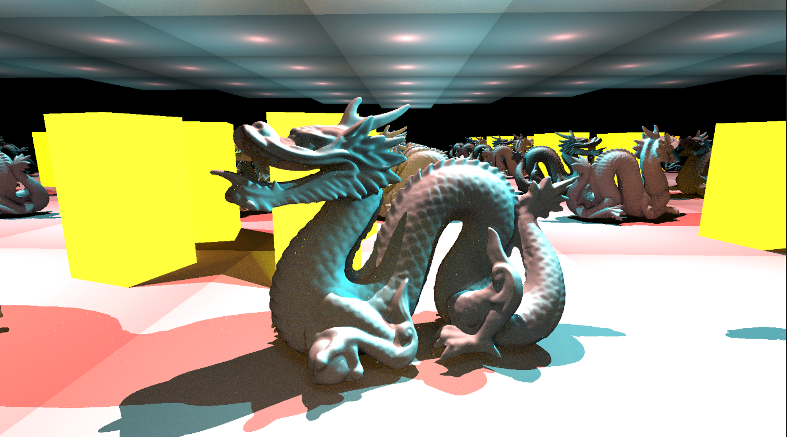
对比
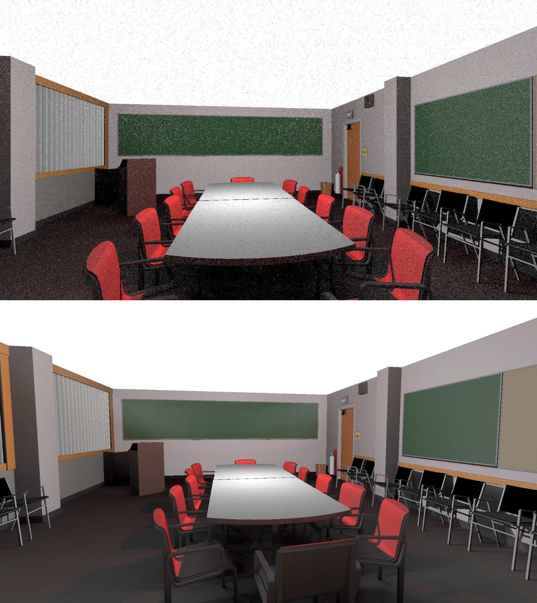

### 第八阶段 优化速度
引入无偏估计，把小能量光通过概率截止，帧数提高250%
内联Min、Max函数，BVH构建时间降低33%
优化AS数据结构，一变量多用途，减少GPU带宽占用

### 暂时退化到普通光追，去掉NEE看看效果
为什么这么灰...
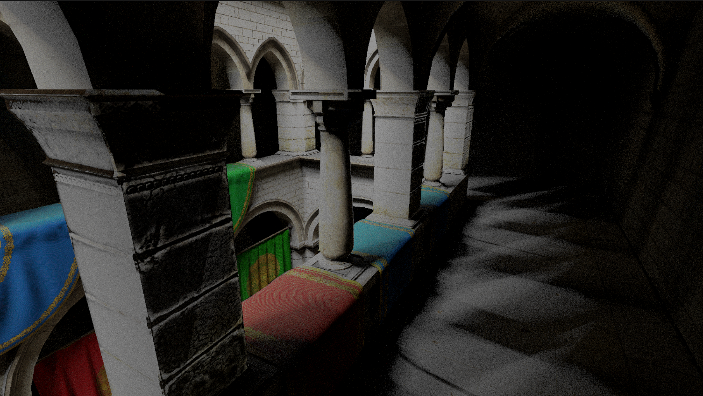
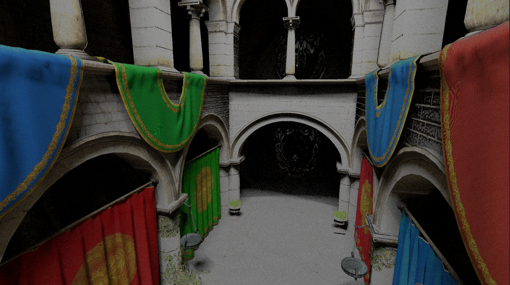