### 效果图
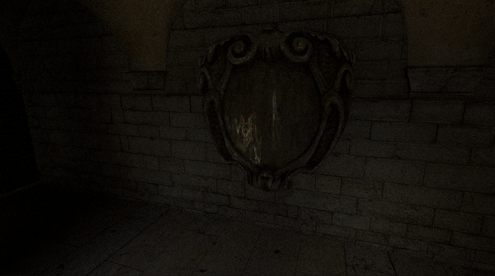
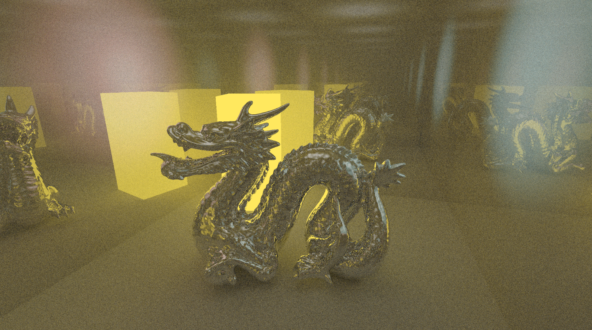
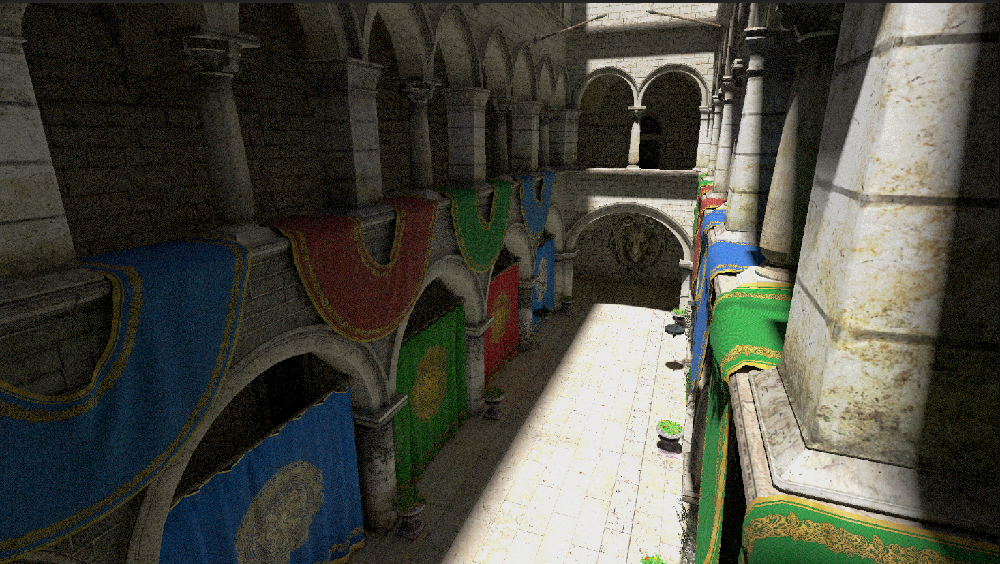
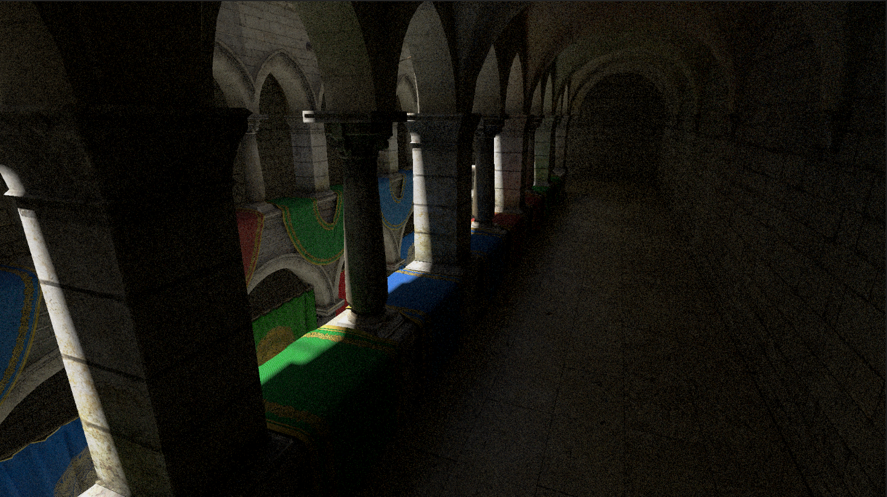

### 第一阶段 纯球体光追

记录一下：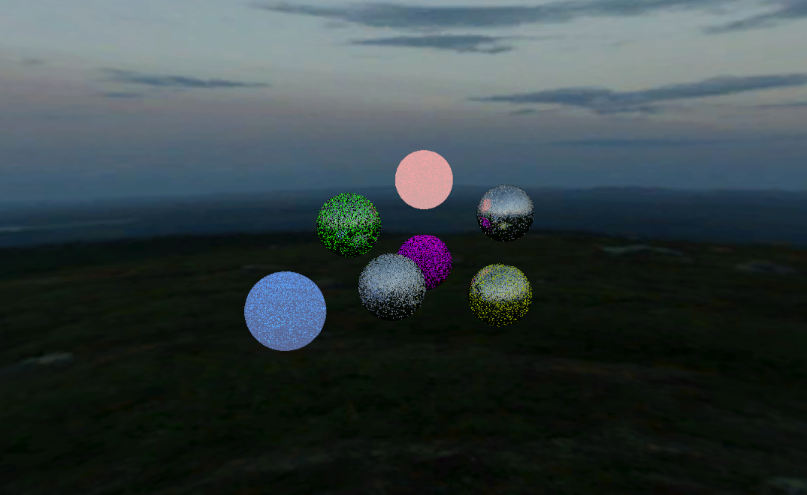

### 第二阶段 实现AS加速结构

下图是通过加速结构获得的网格包围盒
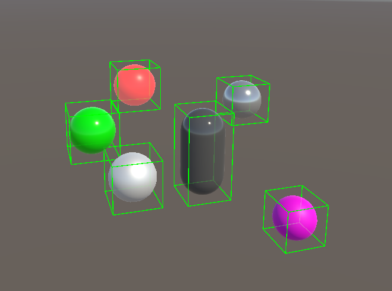
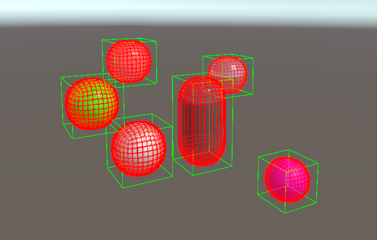

遇到了一些难题，使用栈的时候光线无法正确和BVH相交，但是使用递归的时候可以，这样的帧率很低，只能渲染单一信息，这个问题还没有解决，希望下一阶段可以解决。
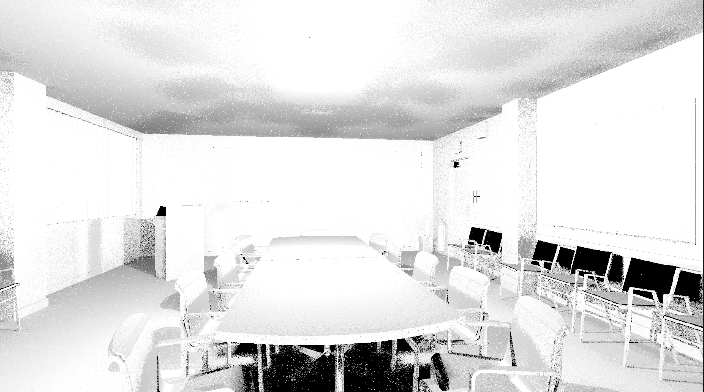
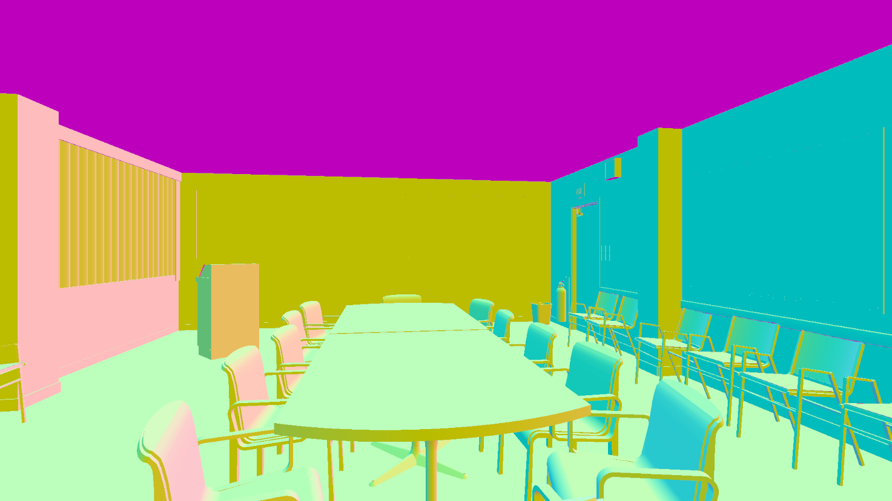
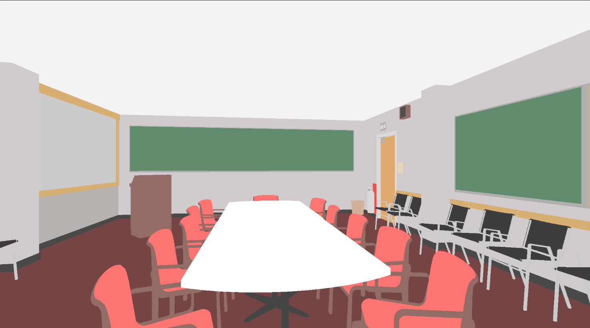

### 第三阶段 实现初步光线追踪
优化了一下BVH的构建，现在可以通过栈的方式而非递归的方式来获取BVH，现在帧率稍微高了一点，并且可以运行初步的光追了。
但色彩上还有些问题

### 第四阶段 修正颜色问题
修正了颜色问题，但某些场景下偏暗。阴影有些硬。后面发现是由于用了“类似”NEE的思想导致的

### 第五阶段 内存&性能提升
内存从原来的大量复制占用15gb，减少到100-200mb
fps提升20倍，复杂场景1.7->37、0.2->8等，简单场景8->120...

### 第六阶段 解决方向光不起作用的问题 && 添加反射验证
解决方向光不起作用的问题
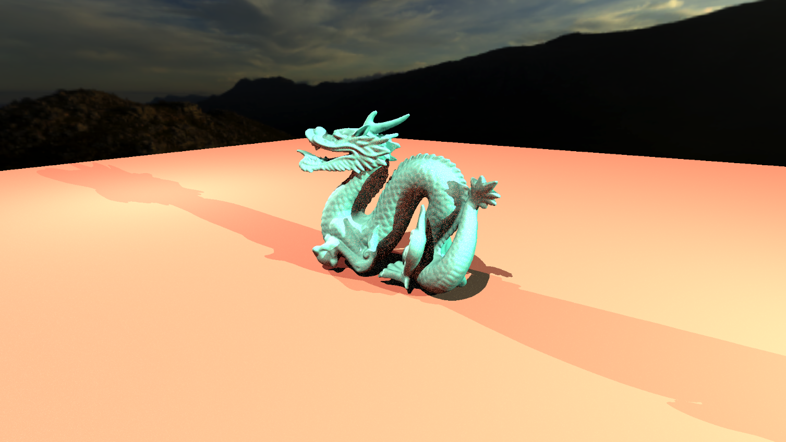
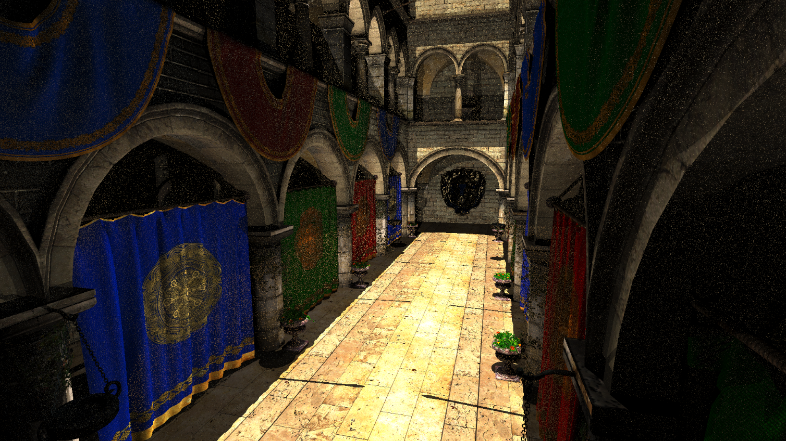
添加反射验证
无反射
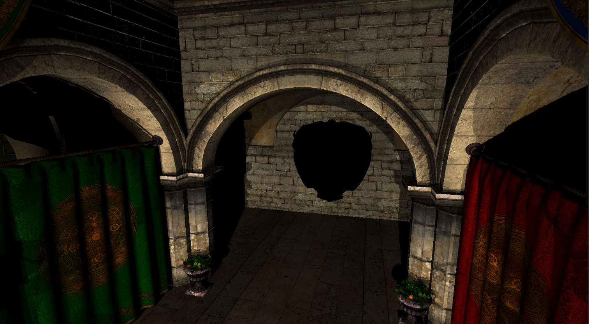
有反射
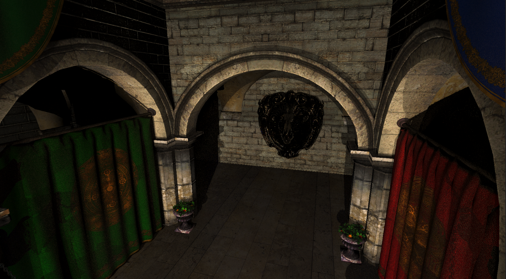

### 第七阶段 添加CPU侧三角形相交测试 && 解决BUG
三角形测试
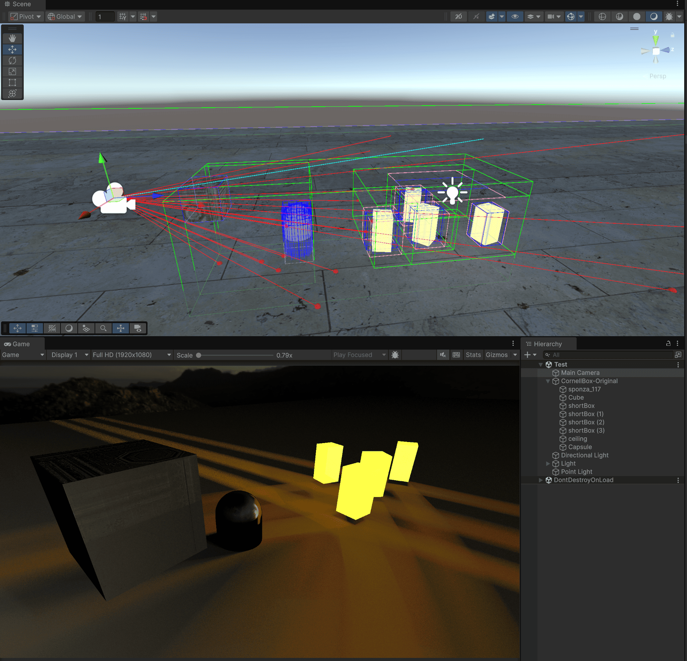
修复BUG后效果
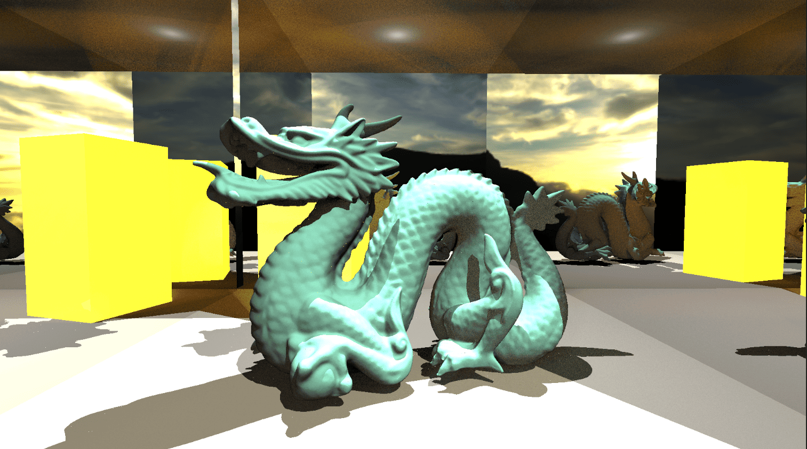
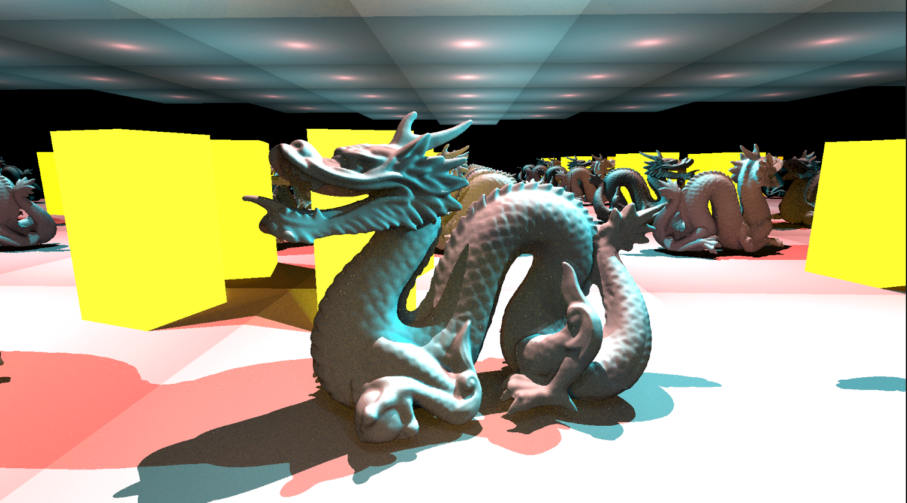
对比
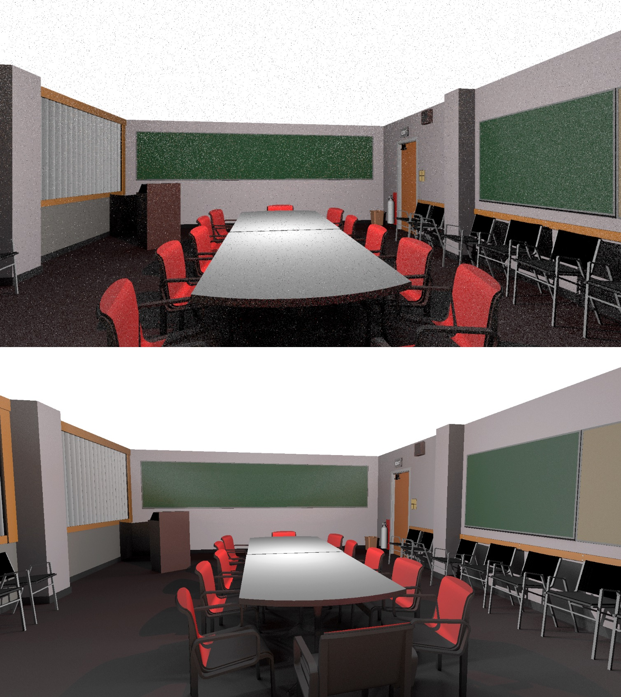

### 第八阶段 优化速度
引入无偏估计，把小能量光通过概率截止，帧数提高250%
内联Min、Max函数，BVH构建时间降低33%
优化AS数据结构，一变量多用途，减少GPU带宽占用

### 第九阶段 正确的光照模型，软阴影

### 第十阶段 实现WaveFront架构
帧数提高一倍，42fps->81fps

## ReSTIR DI / GI 使用与比较

项目使用 Unity `6000.4.4f1`。在场景中选中挂有 `Tracing` 的相机，通过 Inspector 分别开启 `Use ReSTIR DI` 和 `Use ReSTIR GI`；GI 还要求 `Trace Depth` 大于 1。Albedo、Normals、Depth 调试显示开启时不会运行光照采样。场景保存了各自的开关值，因此切换场景后应重新检查 Inspector。

DI 对主表面的方向光和全部项目点光源候选做 reservoir 采样和时间复用，目前不采样发光三角形。常规路径和 ReSTIR 使用同一套光源求值与完整光源列表；有限半径点光源按圆盘参数跨表面重投影。

GI 与常规路径共用首次反弹方向和二次命中，只复用环境或 Lambert 二次表面的局部辐射。接收资格由主表面确定；抽到光滑或透明二次表面时仍计一个零候选，常规路径计算该路径的补集。二次及后续反弹继续由 wavefront 传播。当前模型将非金属且粗糙度至少为 0.999 的材质作为 Lambert 漫反射，GI 不做光滑表面的方向性复用。几何法线用于 Jacobian，着色法线用于 BSDF；归一化检查每个来源的路径支持，包含遮挡，且不截断亮度或 Jacobian。具体估计量、透明模型、模块职责及物理边界见 [ReSTIR 设计决策](docs/ADR-ReSTIR-estimator.md)。

ReSTIR 增加了采样、复用和遮挡查询，并不保证帧率更高；只有少量灯光时，DI 的收益也可能很小。

输出始终对帧结果做逐样本平均；复用使相邻帧相关，不能把累计帧数当作独立样本数。当前没有单独的降噪器。比较画质时，在相同场景、静止相机、分辨率和累计样本数下分别运行常规、DI、GI、DI+GI，查看阴影、间接光噪声及异常亮点。比较性能时关闭 `Write ReSTIR GI Diagnostics`，用 Unity Profiler 的 GPU 时间，并把达到相近噪声水平所需的时间一起比较；诊断捕获帧会执行额外的 GPU 原子计数和读回，日志中的 `frameMilliseconds` 是 CPU 侧提交耗时，不能当作 GPU 渲染时间。首次启用 GI 还可能准备此前未使用的 Compute Shader 内核；`Target Frame Rate` 仅设置帧率上限，不会缩短着色器编译或单帧光线查询。`Candidate Count` 控制 DI 每像素初始候选数；增加它通常会增加每帧成本。

启用诊断后，日志写入 `Tools/Output/<时间戳>_<会话 ID>/`，默认在样本 1、2、4 和设定间隔捕获。普通 Play 结束不自动执行强制 DI+GI 验收。需要诊断时，用 `Tests/Verify-LatestReSTIRGILogs.ps1` 显式检查当次日志；该严格检查要求有效的 DI+GI 捕获及复位后的后续样本。`acceptedCaptures=0, readbackErrors=0` 表示没有采集证据，不能据此判定渲染失败，也不能据此宣称通过验收。慢帧日志中的分段时间仍是 CPU 侧耗时。

图像验收使用 [场景对照](Tests/RenderComparison.md)：真实 Unity 渲染 PT、DI、GI、DI+GI 及组件重启，保存线性 EXR、原始浮点图像、预览和运行清单，按独立种子比较解析解或 PT 参考。日志和编译成功只证明各自覆盖的部分。
