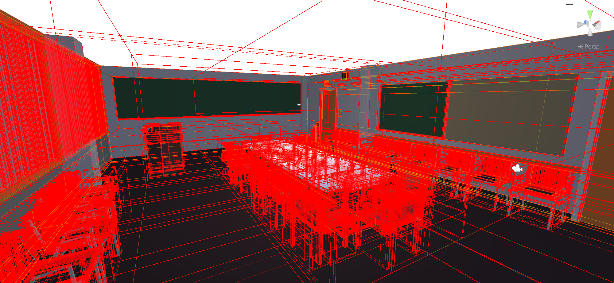
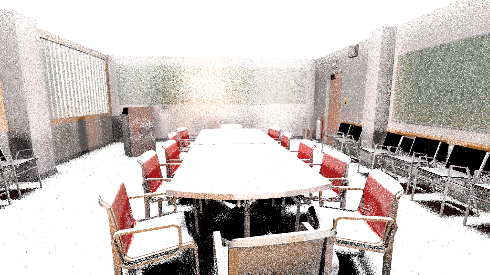
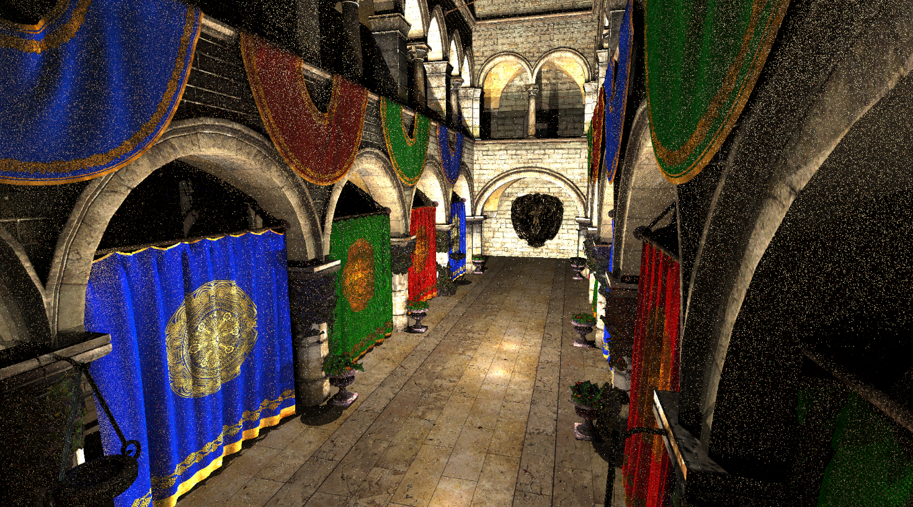
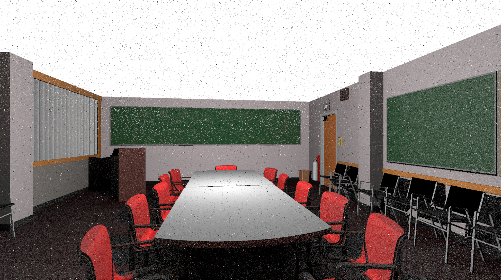

### 第一阶段 纯球体光追

记录一下：

### 第二阶段 实现AS加速结构

下图是通过加速结构获得的网格包围盒

遇到了一些难题，使用栈的时候光线无法正确和BVH相交，但是使用递归的时候可以，这样的帧率很低，只能渲染单一信息，这个问题还没有解决，希望下一阶段可以解决。

### 第三阶段 实现初步光线追踪
优化了一下BVH的构建，现在可以通过栈的方式而非递归的方式来获取BVH，现在帧率稍微高了一点，并且可以运行初步的光追了。
但色彩上还有些问题

### 第四阶段 修正颜色问题
修正了颜色问题，但某些场景下偏暗。阴影有些硬。

