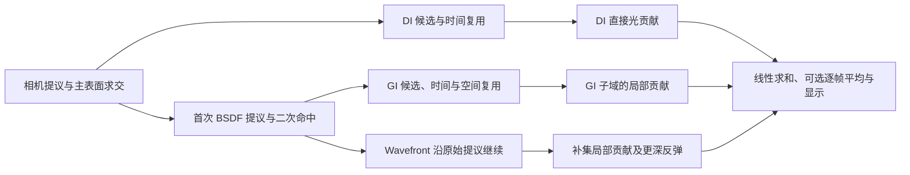

# ReSTIR 的估计量与执行边界

## 目标与适用范围

PT、DI、GI 和 DI+GI 在同一相机、材质、光源模型及路径深度下估计同一个线性 HDR 图像。目标是消除可确定的概率偏差；有限样本图像和日志通过都不能证明所有场景严格无偏。实测入口见 [场景对照](../Tests/RenderComparison.md)。

模型包含方向光、接收点朝向的有限圆盘点光源、BSDF 命中的发光网格和环境贴图。圆盘点光源是项目的灯光模型，其跨接收点映射保持圆盘参数，不是固定世界空间发光网格。解析光源与发光网格属于不同的积分项，当前没有发光三角形的重要性采样。有限路径深度、单次散射 GGX、固定浮点偏移和缺少流形焦散采样，仍限制物理完整性。

## 数据与模块职责

`Tracing` 是相机渲染器及 GPU 资源的所有者。主文件负责生命周期、帧调度及失效；`Tracing.GpuPipeline.cs` 容纳 GPU 资源与 ReSTIR 调度，`Tracing.Output.cs` 容纳显示、帧率控制及诊断输出。这些文件组成同一类型，不引入第二套渲染状态或服务层。相机使用自身的 `LightManager`，灯光管理器不销毁相机，也不把相机保留到其他场景。

`BVHBuilder` 管理场景几何。打包索引缓存只在一次构建中有效；重建时先上传变换，再构建 TLAS。空场景清空 TLAS，着色器按节点数量退出。几何法线和着色法线分别存储：逆转置矩阵变换法线，几何法线用于连接 Jacobian 和射线起点，着色法线用于 BSDF。

`bxdf.hlsl` 定义采样分布及同一分布的求值；`trace.hlsl` 定义统一的光源域和贡献求值；ReSTIR 内核只组合这些估计量。常规路径在任意反弹都使用完整光源列表。显示曝光、色调映射和帧率上限不改变运输估计量；相机、几何、材质、灯光、天空、路径深度及采样模式变化使相关历史失效。

BLAS 遍历先确定最后命中的三角形，再读取完整材质和法线；裁剪透明的 alpha 仍在接受交点前求值。阴影查询只读取覆盖率所需的数据，距离上限固定，已通过父节点测试的子节点直接访问；最近命中查询继续按缩短后的距离复检。队列计数在相机射线生成内核中清零，后续 dispatch 消费这些计数，正常输出留在 GPU。优化的取舍与复验方式见 [性能对照](../Tests/RenderComparison.md#优化的性能对照)。

DI、GI 和历史缓冲按实际开关分配；关闭阶段仅绑定单元素占位资源，并禁止该阶段的像素访问。普通 PT 保留相机运动检测所需的矩阵状态，不复制整帧 ReSTIR 历史。



## 贡献分工

DI 替代主表面的解析直接光估计。启用 DI 后，常规路径跳过这一项，仍计算发光、环境及后续反弹。

GI 的接收资格由主表面确定：不透明或裁剪材质，且包含连续反射分布。GI 只估计首次 BSDF 反弹到环境或 Lambert 二次表面后的局部辐射。设这个路径子域为 Γ，则整个首次间接项为 `IΓ + I非Γ`。抽到光滑、折射或淡出二次表面时，该候选在 Γ 内为零，仍计一次抽样并参与复用；常规路径计算其补集贡献。常规路径共用缓存的首次方向、throughput 和命中，并继续计算更深的反弹。

不能用本次抽到的二次材质决定主表面是否执行 GI，否则启停事件和估计量相关，分域恒等式失效。缓存命中是否可用、接收点是否可复用、当前路径是否由 GI 着色，分别有自己的明确判断。

Wavefront 继续的是原始 BSDF 提议，不是 reservoir 最后选中的二次路径；继续重采样路径需要另行推导后续路径的权重，当前实现没有混用这两种分布。

## PDF、权重与样本数量

连续 BSDF 样本使用完整混合分布 `q = Σ p_lobe q_lobe`，throughput 为 `f cosθ / q`。PT 和 GI 调用同一个求值函数。理想镜面、理想折射和 alpha 直穿是离散事件，不作为连续方向密度处理。缺少 `_IOR` 属性的材质默认折射率为 1.5，非正数或非有限输入在材质上传边界归一到该值。粗糙玻璃使用 GGX 可见法线采样，并在折射 PDF 中包含半向量到方向的 Jacobian；辐射运输包含折射率平方修正。

GI 初始样本的最终乘数是 `W = 1/q`，并不是 `p̂/q`。复用阶段临时累积的流权重为：

其中 `q` 是提议密度；`p̂` 是非负、未归一化的重要性函数，GI 取贡献 RGB 的最大通道。`p̂` 不要求积分为 1，不能再把它当作一个独立提议 PDF 除一次。

```text
S += p̂_current(y) × J(source → current) × W_source × M_source
P(选择该候选 | 已给定候选流) = 该候选流权重 / S
```

选中样本后，用所有参与来源在该样本上的目标值归一化：

```text
π_i(y) = p̂_i(y) × 该来源的路径支持
W_final = S × π_selected(y) / (p̂_current(y) × Σ M_i π_i(y))
最终贡献 = f_current(y) × W_final × 当前连接可见性
```

路径支持包含来源的 BSDF 半球、二次表面的朝向和几何可见性。不能把被遮挡、该来源根本无法采到的连接计入分母。零权重候选仍保留其 `M`；来源选择依据几何与材质，不依据该来源碰巧抽到的候选是否明亮。限制历史 `M` 不缩放已归一化的 `W`；对整个候选流按比例限制 `M` 时，流权重与归一化中的有效数量同步缩放。

有限二次顶点的重连 Jacobian 为 `J = cos_new × distance_old² / (cos_old × distance_new²)`，余弦来自二次顶点的几何法线；环境方向的 `J = 1`。不截断 Jacobian 或亮度来隐藏高方差。

相机路径、DI 候选、DI 替换、GI 候选、二次光照、GI 时间复用和空间复用使用不同随机数域。选择随机数不能复用生成候选时的随机变量。

多维随机样本按显式顺序读取 RNG 状态，不在同一个函数参数列表中多次修改状态。GI 直接调用不透明 BSDF 的采样和求值，Lambert 二次照明使用该材质域的规范参数；通用玻璃分支不进入这些内核的求值路径。

## 透明与可见性

裁剪材质使用 alpha 0.5 阈值。淡出材质是 `alpha × 表面 BSDF + (1-alpha) × 直穿 delta`；求交阶段保留该顶点，发光和连续 BSDF 按 alpha 加权。直接光阴影沿射线累乘淡出透射率。玻璃连接必须通过折射事件，不能由阴影射线按任意概率穿过。

GI 的几何连接停在淡出或玻璃顶点，二者由常规路径传播。这保持了 GI 子域的确定性，避免将随机透明求交误当成已知几何 PDF。淡出直穿同样消耗项目设定的路径深度；深度有限时需把这一模型限制纳入比较。

## 依据与验收

接口和权重语义参考 [NVIDIA ReSTIR GI 集成说明](https://github.com/NVIDIA-RTX/RTXDI/blob/main/Doc/RestirGI.md)，复用条件参考 [Conditional ReSTIR / GRIS](https://research.nvidia.com/labs/rtr/publication/kettunen2023conditional/)，玻璃与可见法线采样参考 [PBRT Dielectric BSDF](https://pbr-book.org/4ed/Reflection_Models/Dielectric_BSDF)。这些资料用于核对数学与假设，不把第三方实现名称当作本工程的正确性证明。

验收保留实际 GPU 的线性图像、运行命令、种子、帧数、上传材质和源码哈希。解析场景对已知均值，实际场景对相同模型下的 PT；组件重启另作同种子像素对照。统计误差按独立种子计算，不能按相关像素或复用的 `M` 计算。冷启动着色器编译、稳定渲染成本及图像均值分别评估。
